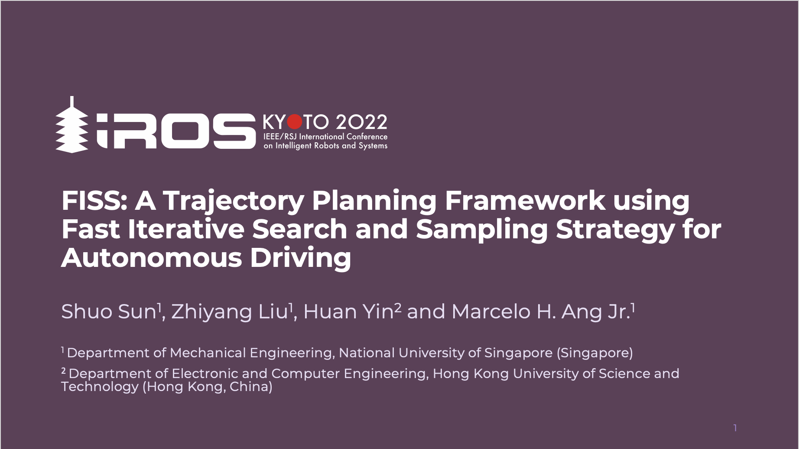

# FISS Planner
## [RA-L 2022] FISS: A Trajectory Planning Framework using Fast Iterative Search and Sampling Strategy for Autonomous Driving

[](https://www.codefactor.io/repository/github/ss47816/fiss_planner)


This is an improved framework based on the framework used in [`frenet_optimal_planner`](https://github.com/SS47816/frenet_optimal_planner). We utilize historical planning results as prior information in heuristics and introduce an iterative search-generate-evaluate strategy to look for the optimal trajectory candidate. Compared to the current frameworks, our method can significantly reduce the number of computationally expensive operations spent during the planning and achieve 2-6 times faster. 

_[Our paper](https://doi.org/10.1109/LRA.2022.3191940) has been accepted by RA-L 2022 and IROS 2022._
> @ARTICLE{Sun_FISS_A_Trajectory_2022,  
author={Sun, Shuo and Liu, Zhiyang and Yin, Huan and Ang, Marcelo H.},  
journal={IEEE Robotics and Automation Letters},   
title={FISS: A Trajectory Planning Framework Using Fast Iterative Search and Sampling Strategy for Autonomous Driving},   
year={2022},  
volume={7},  
number={4},  
pages={9985-9992},  
doi={10.1109/LRA.2022.3191940}}


## Video
<a href="https://youtu.be/jzRzVJsofPU" target="_blank"></a>


## Updates
* [19 Oct 2022] Major updates in the documentation. Now you should be able use this repo **out-of-the box**.

## Dependencies

Our package is only based on standard ROS pkgs, with no other external dependencies:
* C++11 above
* CMake: 3.0.2 above
* Eigen (included)
* ROS Packages:
  * roscpp
  * rospy
  * tf
  * tf2_ros
  * std_msgs
  * nav_msgs
  * geometry_msgs
  * autoware_msgs
  * visualization_msgs
  * dynamic_reconfigure

## Installation
To use this package, you will need to create a `catkin_ws` first. Details please see the [ROS official tutorial](http://wiki.ros.org/catkin/Tutorials/create_a_workspace).

```bash
# locate your catkin workspace (assuming ~/catkin_ws here)
cd ~/catkin_ws/src

# clone the lgsvl_utils repo so that you can use this planner with the lgsvl simulator
git clone https://github.com/SS47816/lgsvl_utils.git
# clone this repo
git clone https://github.com/SS47816/fiss_planner.git

cd ..

# install dependencies
rosdep install --from-paths src --ignore-src -r -y

# build
catkin_make
# source 
source devel/setup.bash
```

## Usage
1. Install the LGSVL simulator by following this [guide](https://www.svlsimulator.com/)
2. Set up your LGSVL simulator and launch the `lgsvl_utils` nodes by following the [guide](https://github.com/SS47816/lgsvl_utils#usage)
3. Launch the FISS planner nodes by running:
    ```bash
    # Launch nodes
    roslaunch fiss_planner fiss_planner.launch
    ```
    The local planner is now waiting for the global route to be published so that it can start planning.
4. You may adjust any config parameters you like in the `dynamic_reconfigure` window. 
5. In the RVIZ window, use the `2D Nav Goal` tool to selet a reachable goal point on the road as the global goal. The global planner will immediately plan a global route for you. And you will soon see the local planner starts planning. 
6. Press the green `A` button on your joystick to enter the autonomous mode.
7. Now you should be able to see your ego vehicle moving. Have fun!

### Update July 2022
The latest instructions to run our code will be coming soon, since the LGSVL simulator is deprecated recently

## Contribution
You are welcome contributing to the package by opening a pull-request

We are following: 
[Google C++ Style Guide](https://google.github.io/styleguide/cppguide.html), 
[C++ Core Guidelines](https://isocpp.github.io/CppCoreGuidelines/CppCoreGuidelines#main), 
and [ROS C++ Style Guide](http://wiki.ros.org/CppStyleGuide)


## License
Our [`fiss_planner`](https://github.com/SS47816/fiss_planner) ROS package is licensed under [Apache License 2.0](https://github.com/SS47816/fiss_planner/blob/main/LICENSE)

The included Eigen Library follows its own [Mozilla Public License v. 2.0](http://mozilla.org/MPL/2.0/)
